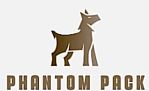

# PhantomPack - Community Donation Platform

<p align="center">
  
</p>

**PhantomPack** is a revolutionary community-driven donation platform that transforms the way we give back. Imagine connecting donors directly with those in need while gamifying the giving experience through an innovative points system. But we're more than just donations - we've integrated an AI-powered therapy chatbot because we understand that sometimes, people need emotional support as much as material assistance. Our platform bridges the gap between material generosity and mental well-being, creating a complete support ecosystem. With **PhantomPack**, we're not just moving items from one person to another; we're building a compassionate community that cares for both body and mind

## 🌟 Features

### 🎁 Donation System
- **Multi-Category Donations**
  - 🍽️ Food items (30 points)
  - 👕 Clothing (20 points)
  - 💍 Accessories (15 points)
  - 📦 Others (10 points)
- **Image Upload Support**
- **Smart Search**
- **Gamified Points System**

### 👤 User Features
- Secure Auth0 Authentication
- Profile Management
- Real-time Leaderboard
- Comprehensive Order History

### 🤖 Therapy Chatbot
- AI-powered mental health support
- Real-time conversation capabilities
- Markdown-formatted responses
- Powered by Google's Gemini API

## 🛠️ Tech Stack

### Frontend


### Backend


## 🚀 Getting Started

### Prerequisites
- Node.js (v18+)
- Python 3.x
- MongoDB
- Auth0 account
- Google Gemini API key

### Installation

1. **Clone the repository**
```bash
git clone https://github.com/yourusername/PhantomPack.git
cd PhantomPack
```

2. **Frontend Setup**
```bash
cd PhantomPack-FE
npm install
npm run dev
```

3. **Backend Setup**
```bash
cd PhantomPack-BE
pip install -r requirements.txt
python app.py
```

4. **Environment Variables**

Create `.env` files in both frontend and backend directories:

Frontend `.env`:
```env
VITE_AUTH0_DOMAIN=your_auth0_domain
VITE_AUTH0_CLIENT_ID=your_client_id
VITE_API_URL=http://localhost:5000
```

Backend `.env`:
```env
MONGODB_URI=your_mongodb_uri
GEMINI_API_KEY=your_gemini_api_key
```

## 📚 API Documentation

### User Management
| Endpoint | Method | Description |
|----------|---------|-------------|
| `/register` | POST | Register new user |
| `/profile/:id` | GET | Get user profile |
| `/profile/:id` | POST | Update user profile |

### Donation Management
| Endpoint | Method | Description |
|----------|---------|-------------|
| `/donate` | POST | Create new donation |
| `/items` | GET | Get all items |
| `/items/:id` | GET | Get item details |
| `/orders/:userId` | GET | Get order history |

## 🤝 Contributing

1. Fork the repository
2. Create your feature branch (`git checkout -b feature/AmazingFeature`)
3. Commit your changes (`git commit -m 'Add some AmazingFeature'`)
4. Push to the branch (`git push origin feature/AmazingFeature`)
5. Open a Pull Request

## 📄 License

This project is licensed under the MIT License - see below for details:

```text
MIT License

Copyright (c) 2025 PhantomPack

Permission is hereby granted, free of charge, to any person obtaining a copy
of this software and associated documentation files (the "Software"), to deal
in the Software without restriction, including without limitation the rights
to use, copy, modify, merge, publish, distribute, sublicense, and/or sell
copies of the Software, and to permit persons to whom the Software is
furnished to do so, subject to the following conditions:

The above copyright notice and this permission notice shall be included in all
copies or substantial portions of the Software.

THE SOFTWARE IS PROVIDED "AS IS", WITHOUT WARRANTY OF ANY KIND, EXPRESS OR
IMPLIED, INCLUDING BUT NOT LIMITED TO THE WARRANTIES OF MERCHANTABILITY,
FITNESS FOR A PARTICULAR PURPOSE AND NONINFRINGEMENT. IN NO EVENT SHALL THE
AUTHORS OR COPYRIGHT HOLDERS BE LIABLE FOR ANY CLAIM, DAMAGES OR OTHER
LIABILITY, WHETHER IN AN ACTION OF CONTRACT, TORT OR OTHERWISE, ARISING FROM,
OUT OF OR IN CONNECTION WITH THE SOFTWARE OR THE USE OR OTHER DEALINGS IN THE
SOFTWARE.
```

---
<p align="center">
  Built with ❤️ for HackNCState 2025
</p>